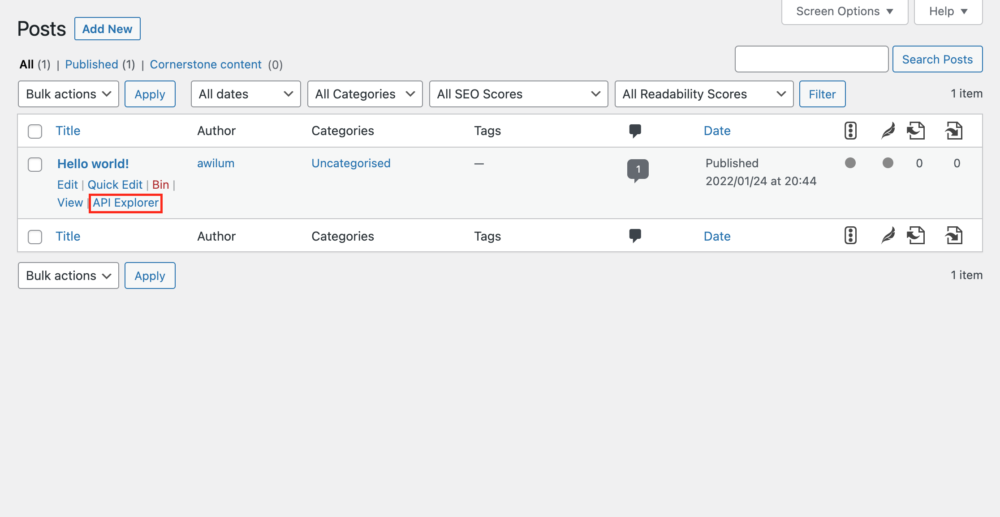
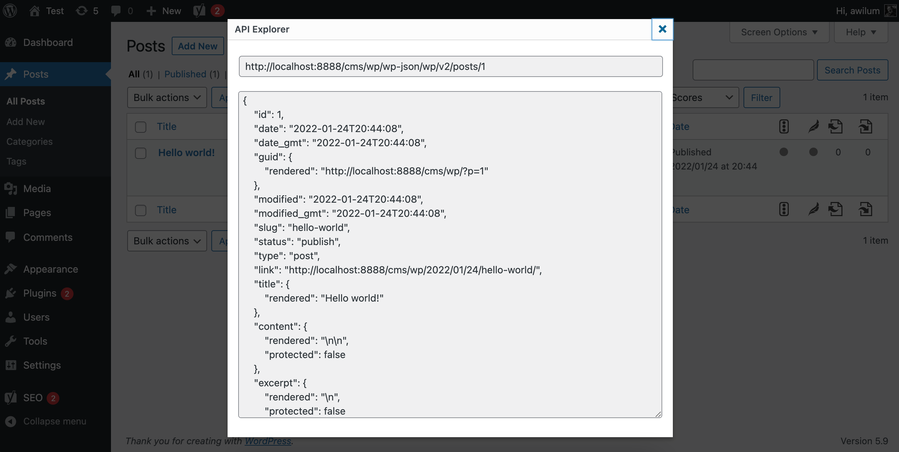

# WordPress API Explorer

WordPress plugins adds API Explorer link for pages, posts, tags, categories and comments

### Installation

1. Create new directory `wp-content/plugins/api-explorer`
2. Download [Api Explorer Plugin](https://github.com/Awilum/wp-api-explorer/releases) and unzip plugin content to the directory `wp-content/plugins/api-explorer`

### License

[GNU GENERAL PUBLIC LICENSE](https://github.com/wp-extends/api-explorer/blob/master/LICENSE)
Copyright (c) [Sergey Romanenko](https://github.com/Awilum)
